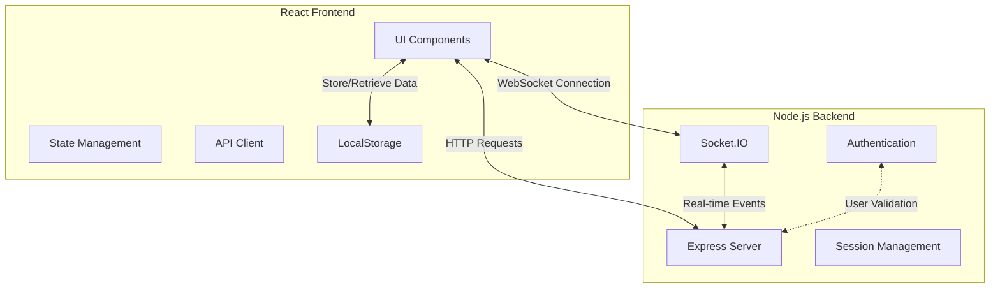
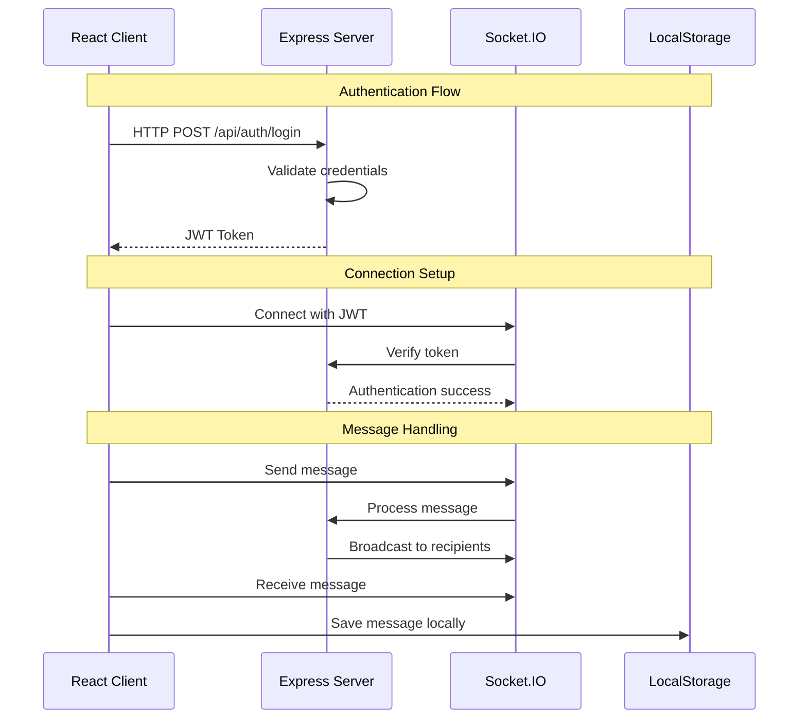

# Chating Fullstack Web App

A real-time chat application built with a modern tech stack, featuring both frontend and backend components for seamless messaging experiences. This application uses Socket.IO for instantaneous real-time communication and localStorage for message persistence on the client side.

  

## 🚀 Tech Stack

### Frontend
- **React** - User interface library
- **Vite** - Fast build tool and development server
- **TypeScript** - Type-safe JavaScript
- **Tailwind CSS** - Utility-first CSS framework
- **React Router** - Client-side routing
- **Axios** - HTTP client for API requests

### Backend
- **Node.js** - JavaScript runtime environment
- **Express.js** - Web application framework
- **Socket.IO** - Real-time bidirectional event-based communication
- **MongoDB** - NoSQL database
- **Mongoose** - MongoDB object modeling
- **JWT** - JSON Web Tokens for authentication
- **bcryptjs** - Password hashing

## 📦 Project Structure

```
chating-fullstack-web-app/
├── client/ # Frontend React application
│ ├── public/ # Static assets
│ ├── src/ # Source code
│ │ ├── components/ # Reusable UI components
│ │ ├── pages/ # Page components
│ │ ├── hooks/ # Custom React hooks
│ │ ├── utils/ # Utility functions
│ │ └── types/ # TypeScript type definitions
│ ├── package.json
│ └── vite.config.ts
├── server/ # Backend Node.js application
│ ├── controllers/ # Route controllers
│ ├── models/ # Database models
│ ├── routes/ # API routes
│ ├── middleware/ # Custom middleware
│ ├── utils/ # Utility functions
│ ├── package.json
│ └── server.js
└── README.md
```


## 📊 System Architecture


## 🔌 Data Flow




## 👨‍💻 Author
Ali Abodaraa

## 🙏 Acknowledgments
Socket.IO for real-time capabilities

Vite team for the excellent build tool

Tailwind CSS for the utility-first CSS framework
